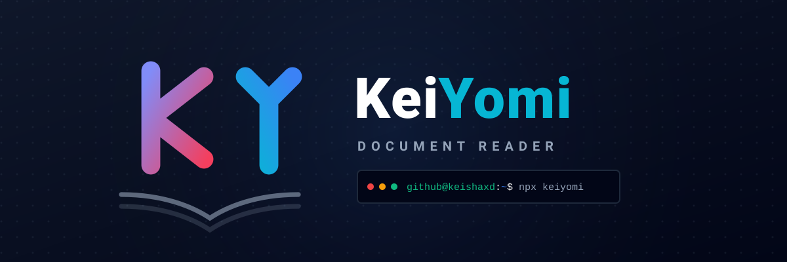

# KeiYomi

[Read in English](README.MD)

KeiYomi adalah aplikasi desktop (PC) berbasis **Electron** untuk membaca novel, dokumen, dan komik digital secara offline dengan antarmuka yang modern dan responsif.

> **Catatan:** Proyek ini terinspirasi oleh aplikasi Android populer **Tachiyomi**. Namun, **KeiYomi sama sekali tidak menggunakan kode sumber dari Tachiyomi**. Ini adalah proyek independen yang dibangun dari nol menggunakan Electron dan teknologi web untuk platform desktop.

## Fitur Utama

- **Dukungan Format:** Membaca file **PDF**, **EPUB**, **CBZ**, **CBR**, **ZIP**, **TXT**, dan **MD**.
- **Mode Baca Fleksibel:**
  - **Mode Webtoon:** Scroll vertikal tanpa putus, cocok untuk Manhwa/Webtoon.
  - **Mode Normal:** Tampilan per halaman, cocok untuk PDF/dokumen.
  - **Mode Kualitas PDF:** Pilih render ringan atau kualitas asli.
- **Manajemen Pustaka:**
  - **Scan Otomatis:** Mendeteksi buku dan folder komik dari folder lokal (`Documents/KeiYomi`).
  - **Riwayat Bacaan:** Menyimpan progres bacaan secara otomatis.
  - **Favorit:** Tandai buku atau chapter tertentu sebagai favorit.
  - **Pencarian & Filter:** Cari buku berdasarkan judul atau filter berdasarkan genre.
  - **Sortir:** Urutkan berdasarkan nama, tanggal, atau terakhir dibaca.
- **Kustomisasi:**
  - **Tema:** Mode Terang dan Gelap.
  - **Bahasa:** Dukungan Bahasa Indonesia dan Inggris.
  - **Edit Metadata:** Ubah judul, penulis, sampul, dan sinopsis langsung dari aplikasi.
- **Alat Data:** Backup, restore, dan hapus data lokal aplikasi.
- **Performa Tinggi:** Menggunakan lazy loading untuk memuat gambar/halaman hanya saat dibutuhkan.

## Teknologi

- Electron
- Node.js
- HTML5, CSS3, JavaScript
- PDF.js untuk render PDF
- JSZip untuk ekstraksi CBZ/ZIP/EPUB
- node-unrar-js untuk ekstraksi CBR/RAR
- Marked untuk render Markdown

## Cara Menjalankan (Development)

1. Pastikan Node.js sudah terinstall. Node.js 22 atau lebih baru direkomendasikan untuk tooling Electron saat ini.
2. Masuk ke folder aplikasi:
   ```bash
   cd "Project File"
   ```
3. Install dependency:
   ```bash
   npm ci
   ```
4. Jalankan aplikasi:
   ```bash
   npm start
   ```

Mode development dan release terinstall memakai identitas app yang sama, yaitu `KeiYomi`, sehingga data aplikasi berada di folder profil OS yang sama:

```text
Windows: %APPDATA%\KeiYomi
```

Jangan jalankan release terinstall dan `npm start` secara bersamaan. Aplikasi memakai single-instance lock untuk mencegah config/cache saling bentrok.

## Build & Release

Jalankan semua command dari folder `Project File`.

### Validasi

```bash
npm run check
```

Command ini mengecek syntax JavaScript untuk main process, preload, dan script UI.

### Build Lokal

Installer Windows x64 dan ARM64 sekaligus:

```bash
npm run build:win
```

Command ini membuat dua installer Windows:

- Windows x64: Windows 64-bit Intel/AMD biasa.
- Windows ARM64: Windows native untuk perangkat ARM.

Target Windows satu per satu:

```bash
npm run build:win:x64
npm run build:win:arm64
```

Paket Linux portable dari Windows:

```bash
npm run build:linux:portable
```

Command ini membuat paket `.tar.gz`. Installer Linux penuh seperti AppImage dan `.deb` sebaiknya dibuild di Linux atau lewat GitHub Actions.

Command lokal yang disarankan untuk development sehari-hari:

```bash
npm run check
npm run build:win:x64
```

Gunakan `npm run build:win` hanya saat ingin membuat dua installer Windows sekaligus.

### Build Multi-Platform Lengkap

```bash
npm run build
```

Command ini menjalankan `npm run build:all` dan meminta electron-builder membangun target Windows, Linux, dan macOS. Command ini tidak direkomendasikan untuk release dari Windows lokal karena build Linux penuh dan macOS butuh environment OS yang sesuai. Untuk artifact release yang stabil, gunakan GitHub Actions:

- Windows x64 dan Windows ARM64 di `windows-2025`.
- Linux AppImage dan `.deb` di `ubuntu-24.04`.
- macOS universal `.dmg` dan `.zip` di `macos-15`.

Catatan:

- Halaman preferensi installer hanya tersedia di installer Windows NSIS.
- Linux dan macOS memakai pengaturan awal dari aplikasi saat pertama kali dibuka.
- macOS build tanpa Apple Developer signing/notarization masih bisa memunculkan peringatan Gatekeeper.

Workflow bisa dijalankan manual dari tab GitHub Actions, atau otomatis dengan push tag versi seperti:

```bash
git tag v3.2.0
git push origin v3.2.0
```

### Update Versi

Saat menyiapkan release baru, ubah versi di file berikut:

- `Project File/package.json`: `version`, `versionCode`, dan `build.extraMetadata.versionCode`.
- `Project File/package-lock.json`: root package version.
- `update.json`: `version`, `versionCode`, `releaseUrl`, dan `changelog`.

Untuk release fitur normal, naikkan minor version, misalnya `3.1.0` ke `3.2.0`. Untuk hotfix kecil saja, naikkan patch version, misalnya `3.2.0` ke `3.2.1`.

## Pintasan Keyboard

- **Panah Atas/Bawah:** Scroll halaman atau navigasi menu.
- **Panah Kiri/Kanan:** Pindah halaman atau chapter sesuai mode baca.
- **ESC:** Kembali, tutup modal, atau keluar aplikasi.

## Struktur Folder (Auto-Scan)

Aplikasi akan membuat folder `KeiYomi` di dalam folder Documents. Susun folder komik seperti berikut agar terdeteksi sebagai satu seri:

```text
KeiYomi/
+-- Judul Manga/
    +-- info.json       (Metadata buku)
    +-- cover.jpg       (Gambar sampul)
    +-- Chapter 1.pdf
    +-- Chapter 2.cbz
    +-- Chapter 3.cbr
    +-- ...
```

## Lisensi

MIT License
