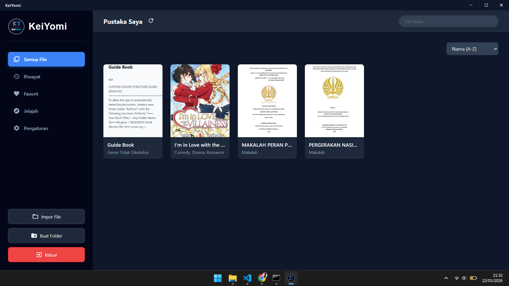
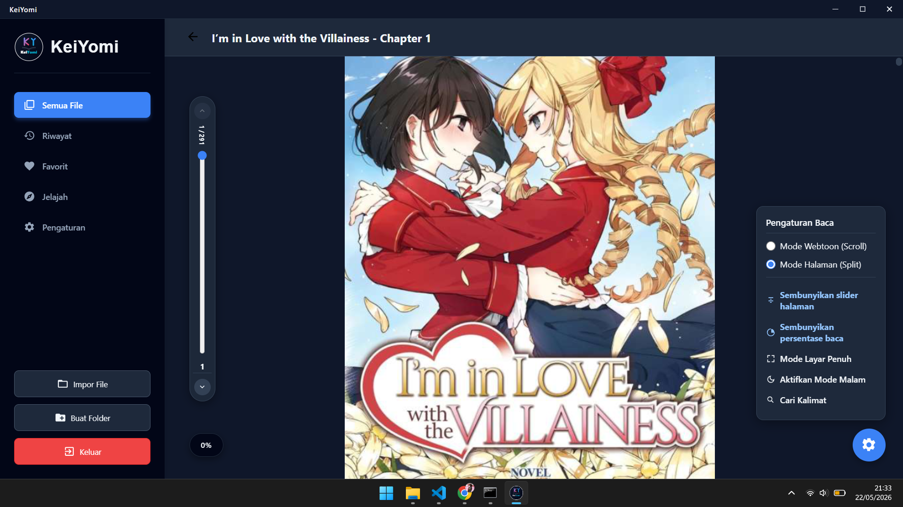
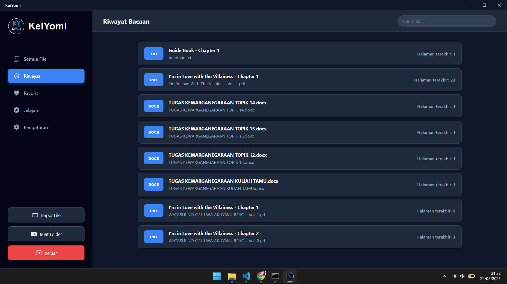
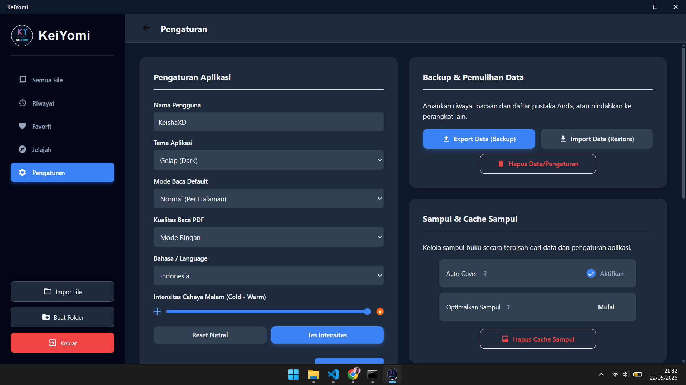

# KeiYomi

[Baca dalam Bahasa Indonesia](README.ID.md)

KeiYomi is a desktop application (PC) based on **Electron** for reading novels, documents, and digital comics offline with a modern and responsive interface.

> **Note:** This project is inspired by the famous Android application **Tachiyomi**. However, please note that **KeiYomi does not use any source code from Tachiyomi**. This is an independent project built from scratch using Electron and web technologies for desktop platforms.

> **Windows SmartScreen Notice:** KeiYomi releases may show a blue "Windows protected your PC" warning because the installer is not code-signed yet. Only download KeiYomi from the official GitHub Releases page, and verify the file name/version before installing.

## Preview

KeiYomi interface preview:



| Reading | Book Detail |
| --- | --- |
|  |  |

| History | Settings |
| --- | --- |
|  |  |

## Key Features

- **Format Support:** Read **PDF**, **EPUB**, **CBZ**, **CBR**, **ZIP**, **TXT**, **MD**, and **DOCX** files.
- **Flexible Reading Modes:**
  - **Webtoon Mode:** Continuous vertical scroll, suitable for Manhwa/Webtoon.
  - **Normal Mode:** Page-by-page view, suitable for PDF/documents.
  - **PDF Quality Mode:** Choose light rendering or original quality.
  - **Reader Controls:** Toggle the page slider and reading percentage indicator from the reading settings menu.
- **Library Management:**
  - **Auto Scan:** Detects books and comic folders from the local folder (`Documents/KeiYomi`).
  - **Reading History:** Automatically saves reading progress.
  - **Favorites:** Mark books or chapters as favorites.
  - **Search & Filter:** Search books by title or filter by genre.
  - **Sort:** Sort by name, date, or last read.
- **Customization:**
  - **Themes:** Light and Dark Mode.
  - **Language:** Indonesian and English.
  - **Edit Metadata:** Change title, author, cover, and synopsis directly from the app.
- **Data Tools:** Backup, restore, and clear local app data.
- **Offline Vendor Runtime:** PDF, EPUB/CBZ/ZIP, CBR/RAR, Markdown, and DOCX support use bundled local vendor files.
- **High Performance:** Uses lazy loading to load images/pages only when needed.

## Technologies

- Electron
- Node.js
- HTML5, CSS3, JavaScript
- PDF.js for PDF rendering
- JSZip for CBZ/ZIP/EPUB extraction
- node-unrar-js for CBR/RAR extraction
- Marked for Markdown rendering
- Mammoth for DOCX rendering

## Install on Windows

1. Download `KeiYomi-Setup-3.2.0-x64.exe` or the latest installer from the official GitHub Releases page.
2. Run the installer and follow the setup wizard.
3. If Windows SmartScreen appears, confirm that the file name and version match the official release before continuing.
4. Open KeiYomi from the Start Menu or desktop shortcut.

## How to Run (Development)

1. Ensure Node.js is installed. Node.js 22 or newer is recommended for the current Electron build tooling.
2. Enter the app folder:
   ```bash
   cd "Project File"
   ```
3. Install dependencies:
   ```bash
   npm ci
   ```
4. Run the application:
   ```bash
   npm start
   ```

Quick developer start:

```bash
cd "Project File"
npm ci
npm start
```

Development and installed releases use the same app identity, `KeiYomi`, so app data is stored in the same OS profile folder:

```text
Windows: %APPDATA%\KeiYomi
```

Do not run the installed release and `npm start` at the same time. The app uses a single-instance lock to prevent config/cache collisions.

## Build & Release

Run all commands from the `Project File` directory.

### Developer Build Menu

Windows developers can use the batch menu:

```bat
build.bat
```

The menu includes Windows x64, Windows ARM64, Windows portable x64, Windows portable ARM64, Linux builds, Linux portable, macOS builds, all-platform builds, and a check-only option.

### Validation

```bash
npm run check
```

This checks JavaScript syntax for the main process, preload, and UI scripts.

### Local Builds

Windows x64 and ARM64 installers together:

```bash
npm run build:win
```

This creates two Windows installers:

- Windows x64: regular 64-bit Intel/AMD Windows.
- Windows ARM64: native Windows on ARM devices.

Individual Windows targets:

```bash
npm run build:win:x64
npm run build:win:arm64
```

Windows portable targets:

```bash
npm run build:win:portable:x64
npm run build:win:portable:arm64
```

Linux portable package from Windows:

```bash
npm run build:linux:portable
```

This creates a `.tar.gz` package. Full Linux installers such as AppImage and `.deb` should be built on Linux or through GitHub Actions.

Linux and macOS targets:

```bash
npm run build:linux
npm run build:mac
```

Windows builds are safe to compile locally on Windows. Linux portable can also be created from Windows, while full Linux installers are more reliable on Linux or CI. macOS release builds should be created on macOS or a macOS CI runner, especially for signing/notarization.

Recommended local development build flow:

```bash
npm run check
npm run build:win:x64
```

Use `npm run build:win` only when you want to create both Windows installers at once.

### Full Multi-Platform Builds

```bash
npm run build
```

This maps to `npm run build:all` and asks electron-builder to build Windows, Linux, and macOS targets. This is not recommended for release builds from local Windows because full Linux packaging and macOS packaging need the matching OS environment. For reliable release artifacts, use GitHub Actions:

- Windows x64 and Windows ARM64 on `windows-2025`.
- Linux AppImage and `.deb` on `ubuntu-24.04`.
- macOS universal `.dmg` and `.zip` on `macos-15`.

Notes:

- The installer preference page is available only in the Windows NSIS installer.
- Linux and macOS use the app's first-run/default settings instead.
- macOS builds without Apple Developer signing/notarization may show a Gatekeeper warning.

The workflow can be started manually from GitHub Actions, or automatically by pushing a version tag such as:

```bash
git tag v3.2.0
git push origin v3.2.0
```

### Version Updates

When preparing a new release, update the version in these files:

- `Project File/package.json`: `version`, `versionCode`, and `build.extraMetadata.versionCode`.
- `Project File/package-lock.json`: root package version.
- `update.json`: `version`, `versionCode`, `releaseUrl`, and `changelog`.

For normal feature releases, increment the minor version, for example `3.1.0` to `3.2.0`. For small hotfixes only, increment the patch version, for example `3.2.0` to `3.2.1`.

## Keyboard Shortcuts

- **Up/Down Arrow:** Scroll page or navigate menu.
- **Left/Right Arrow:** Change page or chapter depending on the current reader mode.
- **ESC:** Back, close modal, or exit app.

## Folder Structure (Auto-Scan)

The application will create a `KeiYomi` folder inside your Documents folder. You can organize comic folders as follows to be detected as a series:

```text
KeiYomi/
+-- Manga Title/
    +-- info.json       (Book metadata)
    +-- cover.jpg       (Cover image)
    +-- Chapter 1.pdf
    +-- Chapter 2.cbz
    +-- Chapter 3.cbr
    +-- Notes.docx
    +-- ...
```

## Contributing & Bug Reports

- Open an issue for bugs, crashes, broken file formats, or confusing reader behavior.
- Include the app version, OS version, file type, reproduction steps, and screenshots or logs when possible.
- For code contributions, keep changes focused, run `npm run check`, and describe the user-facing impact in the pull request.
- Keep the English and Indonesian README files consistent when changing setup, build, or release instructions.

## License

MIT License
